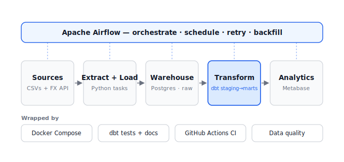

# Olist E-Commerce ELT Pipeline

A production-shaped **ELT pipeline** built on the modern data stack:
**Airflow** orchestrates extraction and loading, **dbt** transforms raw data
into a tested dimensional model in **Postgres**, and **Metabase** serves the
analytics — all running locally with a single `docker compose up`.

The dataset is the [Olist Brazilian E-Commerce](https://www.kaggle.com/datasets/olistbr/brazilian-ecommerce)
public dataset (~100k orders across 9 related tables).



## What this project demonstrates

- **Orchestration** with Airflow: a scheduled, retrying DAG with idempotent,
  **per-day incremental loads** and historical **backfills**.
- **ELT modeling** with dbt: a layered `staging → intermediate → marts`
  project with a star schema, surrogate keys, an **incremental** fact model,
  and a **snapshot** (slowly-changing dimension).
- **Data quality** as a pipeline gate: generic dbt tests
  (`not_null`, `unique`, `accepted_values`, `relationships`) plus a custom
  singular test, all run inside the DAG via [Cosmos](https://www.astronomer.io/cosmos/)
  so each model/test is its own Airflow task.
- **Reproducibility**: fully containerized; clone, drop in the data, and run.
- **CI**: GitHub Actions runs `dbt deps`, `sqlfluff` lint, and `dbt compile`
  on every pull request.

## Tech stack

| Layer | Tool |
|---|---|
| Orchestration | Apache Airflow 2.10 (LocalExecutor) |
| Airflow ↔ dbt | astronomer-cosmos |
| Transformation | dbt 1.8 (`dbt-postgres`) |
| Warehouse | PostgreSQL 16 |
| BI / dashboard | Metabase |
| Packaging | Docker Compose |
| CI | GitHub Actions + sqlfluff |

## Repository layout

```
.
├── docker-compose.yml          # Airflow + warehouse Postgres + Metabase
├── Dockerfile                  # Airflow image; dbt in an isolated venv
├── dags/
│   └── olist_elt_dag.py        # extract -> load -> dbt (Cosmos task group)
├── include/
│   ├── extract/load_olist.py   # idempotent, per-day extract/load
│   └── dbt/                     # the dbt project
│       ├── models/{staging,intermediate,marts}/
│       ├── snapshots/  tests/  macros/
│       ├── dbt_project.yml  profiles.yml  packages.yml
│       └── .sqlfluff
├── data/raw/                   # drop the Kaggle CSVs here (gitignored)
├── docs/architecture.svg
└── .github/workflows/ci.yml
```

## Quickstart

### 1. Get the data
Download the [Olist dataset](https://www.kaggle.com/datasets/olistbr/brazilian-ecommerce)
and unzip the 9 CSVs into `data/raw/`. With the
[Kaggle CLI](https://github.com/Kaggle/kaggle-api):

```bash
kaggle datasets download -d olistbr/brazilian-ecommerce -p data/raw --unzip
```

You should end up with `data/raw/olist_orders_dataset.csv`, etc.

### 2. Start the stack

```bash
cp .env.example .env
docker compose up -d --build
```

First build takes a few minutes. When it settles:

| Service | URL | Login |
|---|---|---|
| Airflow | http://localhost:8080 | `admin` / `admin` |
| Metabase | http://localhost:3000 | set up on first visit |
| Warehouse Postgres | `localhost:5434` | `warehouse` / `warehouse` |

### 3. Run the pipeline
The DAG is dated to the Olist history (2016–2018), so unpausing alone won't
load anything (`catchup` is off by design). Backfill a date range instead:

```bash
docker compose exec airflow-scheduler \
  airflow dags backfill olist_elt -s 2017-01-01 -e 2017-03-31
```

Each run loads that day's orders into `raw`, then Cosmos runs the dbt models
and tests. Browse the modeled tables in the `marts` schema, then point
Metabase at the warehouse (`host: warehouse, port: 5432, db: warehouse`).

## How it works

**Extract/Load** (`include/extract/load_olist.py`) lands the raw CSVs as text
in the `raw` schema. Reference tables are full-refreshed each run; orders and
order items are loaded **one logical day at a time** and deleted-then-inserted
per day, so re-running a date is safe (idempotent) and backfills compose
cleanly.

**Transform** (`include/dbt/`) is layered:
- `staging/` — one model per source; cast + rename only (1:1 with raw).
- `intermediate/` — ephemeral joins and business logic (delivery timing, item
  enrichment).
- `marts/` — the star schema.

### Data model (marts)

```
        dim_customers          dim_products   dim_sellers
              │                      │              │
              └──────────┐      ┌────┴───────┐      │
                         ▼      ▼            ▼      ▼
   dim_dates ───────►  fct_orders        fct_order_items  ◄─── (incremental)
                         ▲                                 fct_payments
                  dim_geography
```

- `fct_orders` — grain: one order; delivery, payment, and review measures.
- `fct_order_items` — grain: one line item; **incremental** on `order_date`.
- `dim_customers` — keyed on `customer_unique_id` (the real person), which is
  what enables repeat-purchase analysis — a detail most tutorials miss.

### Questions the marts answer
Delivery time vs. estimate by state · review-score drivers (delay
correlation) · GMV by category and region over time · seller on-time rate ·
repeat-customer rate.

## Data quality
Every key column has `not_null` / `unique` tests; foreign keys use
`relationships`; `order_status` and `review_score` use `accepted_values`.
A singular test asserts every `delivered` order has a delivery timestamp.
With Cosmos `TestBehavior.AFTER_EACH`, a failing test stops the affected
branch of the DAG.

## Notes & troubleshooting
- **dbt runs in an isolated virtualenv** (`/opt/dbt-venv`) so its dependencies
  never clash with Airflow's. Cosmos points at it via `ExecutionConfig`.
- If the Airflow DAG shows an import error on first boot, give the
  `airflow-init` container a moment — it fetches dbt packages (`dbt deps`)
  into the mounted project so Cosmos can parse the graph.
- The warehouse is exposed on host port **5434** (5432 is used internally).

## Roadmap
- [ ] Seed a Metabase dashboard and commit screenshots to `docs/`.
- [ ] Add `dbt docs generate` + publish the catalog.
- [ ] Add Great Expectations or `dbt-expectations` for richer checks.
- [ ] Enrich with a live FX (BRL/USD) feed to show batch + incremental in one DAG.
